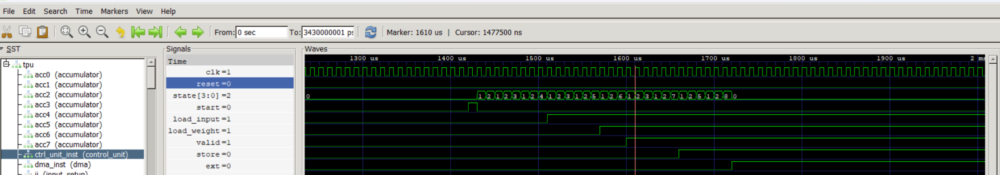
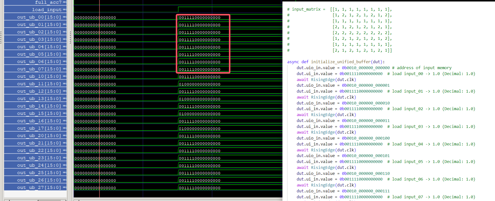
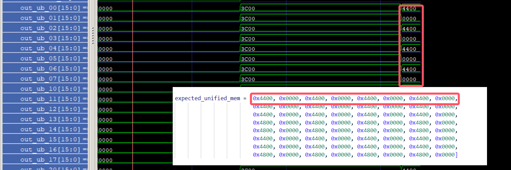
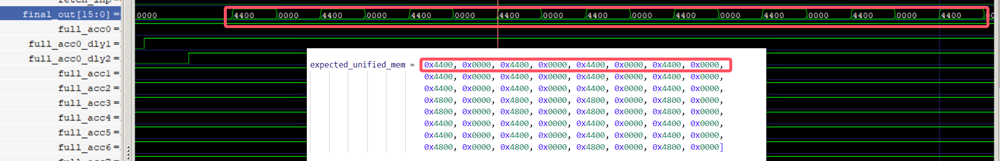
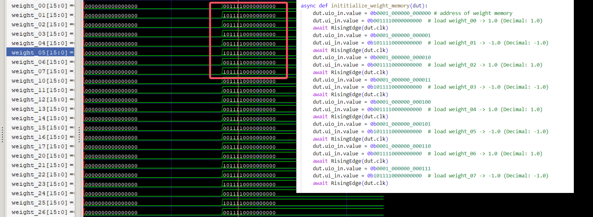
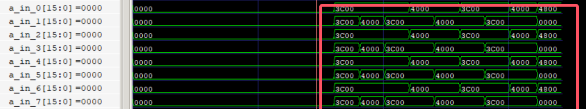
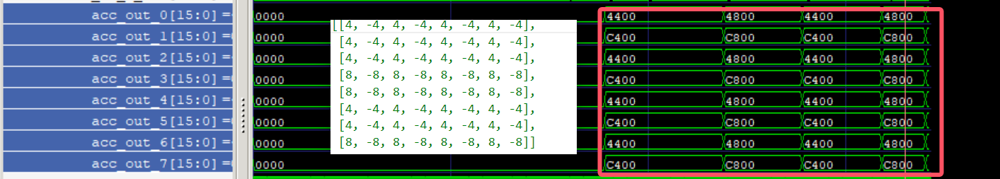
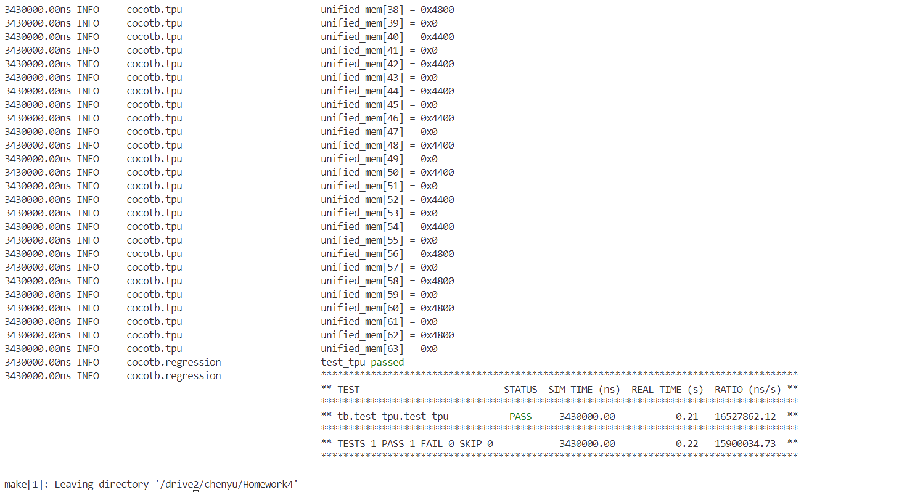
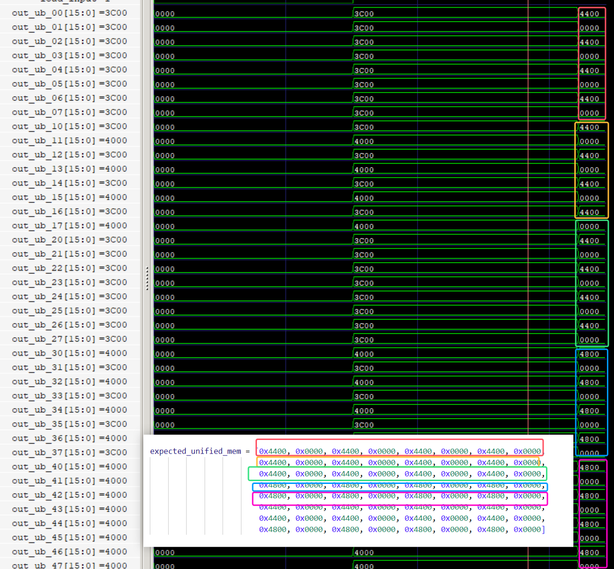

# Report of HW4

**Name**:Chenyu Zhang

**SID**:50018564

**email**:czhang539@connect.hkust-gz.edu.cn

[TOC]

## Implementation
My design has the following sub-modules. Below I will briefly introduce the functions implemented by different sub-modules:

**dma**: By decoding the uio_in signal, output the fetch_inp, fetch_ins, and fetch_w signals to the weight_memory, unitifed buffer, and control modules for initialization operations, and extract the data of these three modules from dram to bram; at the same time, output the start signal, which starts after the initialization is completed. 

**Control unit**: Mainly performs two functions. First, when the fetch_ins signal = 1, the instruction loading (dram-bram) is performed. After the loading is completed, the start signal = 1 to start the control of the TPU module. We use a state machine to control operations, looping through the three states of instruction extraction, instruction decoding, and execution of decoded operations. The operations performed sequentially after decoding are load_weight, load_input, compute(vaild), store, ext. When performing this corresponding operation, the corresponding register is always pulled high.

**weight_memory**: Mainly performs two functions. First, when the fetch_w signal = 1, weight loading (dram-bram) is performed. After the loading is completed, when the load_weight signal = 1, the loaded 64 weights are mapped to 64 weight output ports.

**Unified buffer**: Mainly performs four functions. First, when the fetch_inp signal = 1, the input data is loaded (dram-bram). Secondly, after the loading is completed, the load_input signal = 1. The 64 input data will be loaded (existed in unified mem) into the 64 input data output ports. The third function is to rewrite the 64 processed data of the 8 accmulator into unified mem when the full signal of the accmulator is 1. The fourth function is to detect the ext When the signal is 1 and the rewrite completion signal is 1, the 64 processed data of unified mem are output to the output port uo_out in sequence.

**Inputset up**: Realizes the function of rearranging the 64 input data of the unified buffer and delaying the output. Since the systolic array processes a column of input data, it takes 7+8=15 cycles to delay, so if the input of the systolic array is inputted every cycle, it will lead to calculation errors (one column of input data in the current period is updated to the next column of input data before it has been calculated, which will cause the two values ​​​​added by the PE module are the results of multiplying the input data of different columns and the weight.So it will lead to calculation errors), we introduce the counter signal, which accumulates 1 in each cycle. The output data of the inputset will not be updated until the accumulation reaches 15, so as to realize the function of delayed output of input data and ensure that the calculation of the input data of the current column is completed. Then update the data in the next column.

**systolic array**: On the basis of homework3, **output_vaild** is added as the output port signal and control signal, because the judgment logic of accmulator is invalid and when the data is not empty, systolic is written to the mem of accmulator. The output of the array in the sytolic module, if the output is always valid, the uncalculated intermediate results will be stored in the accmulator's mem, so we add the output_vaild signal here, which is an edge signal whose function is outp When ut_vaild is 1, the result of the systolic array calculation is assigned to the output port. The implementation logic is that when a change in the input data is detected, a delay of 15 cycles is performed to complete the current input stream processing. After the processing is completed, output_vaild is set to 1, and the next cycle set to 0, then update the input stream, and count again.

**accmulator**: **Output_vaild** is newly added as an input port. Its function is to write the output of the systolic array to the mem of the accmulator when output_vaild=1 and vaild=1 are detected. The reason for adding this port is that the value of the systolic output is detected when output_vaild is detected. When it is 1, the data will be updated, and when output_vaild is 0, the data will be latched. In order to prevent the continuous writing of latched data, we set here that the currently latched data will only be written when output_vaild=1. In our design, 8 accmulators are used to store data.

**rule**: Activate the data read from the accmulator. In our design, 64 rule modules are instantiated to activate the data.


### TPU

1.DMA receive uio_in from off-chip,outputting the fetch_inp and dma_address to unitifed buffer, outputting fetch_ins,start and dma_address to control unit, and fetch_w and dma_address to weight mem , ,and control modules ,ou

2.Control Unit receive the fetch_ins(dma_address,ui_in,start) from dma. Control Unit output load_weight to weight mem and systolic array; outputting load_input and store and ext to unified buffer, outputting compute(vaild) to inputset and systolic array and accumulator.

3.Weight mem receive the fetch_w(dma_address,ui_in) from DMA.Weight mem receive the load_weight from Control Unit.Outputting 64 weights to systolic array.

4.Unified buffer receive the fetch_w(dma_address,ui_in) from DMA,receiving the 8 full signals from 8 different accumulator, receiving 64 different activation from 64 rules,outputting 64 input data to inputset,outputting final data to off-chip mem.

5.Inputset receive 64 inputs from Unified buffer,receiving vaild from control unit,outputting 8 data to systolic array.

6.Systolic array receive 8 inputs from Inputset,receiving 64 weights from weight mem,receiving vaild and input_weight from control unit.outputting 8 processed data and output_vaild to accumulator.

7.8 different accumulators receives 8 different acc_in from systolic array,outputting the full signal and 8 different to 64 relus.

8.64 different relus receives 8 different accumulators's 64 differents values,outputting 64 activations to unified buffer.


### Control Unit
    // 指令操作码定义
    localparam [2:0]
        OP_NOP        = 3'b000,
        OP_LOAD_ADDR  = 3'b001,
        OP_LOAD_WEIGHT= 3'b010,
        OP_LOAD_INPUT = 3'b011,
        OP_COMPUTE    = 3'b100,
        OP_STORE      = 3'b101,
        OP_EXT        = 3'b111;

    // 状态机状态定义
    typedef enum logic [3:0] {
        IDLE,
        FETCH,
        DECODE,
        LOAD_ADDR,
        LOAD_INPUT,
        LOAD_WEIGHT,
        COMPUTE,
        STORE_RESULT,
        EXT_OP
    } state_t;

The defined state machine state transfer logic and specific code implementation are as follows:
When fetch_ins=1, it enters the IDLE state and loads instructions into the memory;
When strart is 1, it enters the fetch state and extracts data from instruction_memory to current_instruction;
After extraction, enter the decode state and transfer to the corresponding OP_LOAD_ADDR, OP_LOAD_INPUT, OP_LOAD_WEIGHT, OP_COMPUTE, OP_STORE, OP_EXT state according to the operation code;
After executing OP_LOAD_ADDR, OP_LOAD_INPUT, OP_LOAD_WEIGHT, OP_COMPUTE, OP_STORE, the state is transferred to the fetch state, and after executing OP_EXT, it is transferred to the IDLE state;
```
    state_t state;
    // 主控制逻辑和状态机
    always @(posedge clk or posedge reset) begin
        if (reset) begin
            // 重置所有信号和状态
            state <= IDLE;
            pc <= 6'd0;
            current_instruction <= 16'd0;            
            base_address <= 6'd0;
            load_input <= 1'b0;
            load_weight <= 1'b0;
            valid <= 1'b0;
            store <= 1'b0;
            ext <= 1'b0;
        end else begin
            case (state)
                IDLE: begin
                    if (fetch_ins) begin
                        // 加载指令到指令存储器
                        instruction_memory[dma_address] <= ui_in;
                    end else if (start) begin
                        // 开始执行指令
                        state <= FETCH;
                    end
                end

                FETCH: begin
                    // 从指令存储器中取指令
                    current_instruction <= instruction_memory[pc];
                    pc <= pc + 6'd1;
                    state <= DECODE;
                end

                DECODE: begin
                    opcode <= current_instruction[15:13];
                    addr_field <= current_instruction[12:7];
                    // 根据操作码转移到相应的状态
                    case (opcode)
                        OP_LOAD_ADDR:  state <= LOAD_ADDR;
                        OP_LOAD_INPUT: state <= LOAD_INPUT;
                        OP_LOAD_WEIGHT:state <= LOAD_WEIGHT;
                        OP_COMPUTE:    state <= COMPUTE;
                        OP_STORE:      state <= STORE_RESULT;
                        OP_EXT:        state <= EXT_OP;
                        default:       state <= FETCH;  // NOP或未定义指令，直接取下一条指令
                    endcase
                end

                LOAD_ADDR: begin
                    // 执行 LOAD_ADDR 指令
                    base_address <= addr_field;
                    state <= FETCH;  // 完成后取下一条指令
                end

                LOAD_INPUT: begin
                    // 执行 LOAD_INPUT 指令
                    load_input <= 1'b1;
                    state <= FETCH;  // 完成后取下一条指令
                end

                LOAD_WEIGHT: begin
                    // 执行 LOAD_WEIGHT 指令
                    load_weight <= 1'b1;
                    state <= FETCH;  // 完成后取下一条指令
                end

                COMPUTE: begin
                    // 执行 COMPUTE 指令
                    valid <= 1'b1;
                    state <= FETCH;  // 完成后取下一条指令
                end

                STORE_RESULT: begin
                    // 执行 STORE 指令
                    store <= 1'b1;
                    state <= FETCH;  // 完成后取下一条指令
                end

                EXT_OP: begin
                    // 执行 EXT 指令，结束执行
                    ext <= 1'b1;
                    state <= IDLE;   // 回到空闲状态
                    pc <= 6'd0;      // 重置程序计数器
                end

                default: begin
                    state <= IDLE;
                end
            endcase
        end
    end
```

In the case of tb, the specific simulation waveform is as shown below. By analyzing the following simulation waveform, it is consistent with the state transfer instructions given in the tb file. 1-2-3-1-2-4 represents loading in weight mem starting from base address 0. Weight, 1-2-3-1-2-5-1-2-6 means loading input data from base address 0 and starting calculation; 1-2-3-1-2-7 means starting from base address 0 Store, consistent with simulation results and incentives.



### Unified Buffer
```
First, when the fetch_inp signal = 1, the input data is loaded (dram-bram).

    // First Function: Load inputs from DRAM into unified buffer
    always @(posedge clk) begin
        if (reset) begin
            // Optionally initialize unified_mem
            for (integer i = 0; i < 63; i = i + 1)
                unified_mem[i] <= 16'd0;
        end else if (fetch_inp) begin
            // Load data from DRAM into unified buffer
            unified_mem[dma_address] <= ui_in;
        end
    end
```
Secondly, after the loading is completed, the load_input signal = 1. The 64 input data will be loaded (existed in unified mem) into the 64 input data output ports.Here we only show the unified_mem[0-7],
```
    // Output data to 'out_ub_**' when 'load_input' is high
    always @(*) begin
        if (load_input) begin
            out_ub_00 = unified_mem[addr + 0];
            out_ub_01 = unified_mem[addr + 1];
            out_ub_02 = unified_mem[addr + 2];
            out_ub_03 = unified_mem[addr + 3];
            out_ub_04 = unified_mem[addr + 4];
            out_ub_05 = unified_mem[addr + 5];
            out_ub_06 = unified_mem[addr + 6];
            out_ub_07 = unified_mem[addr + 7];
```

In the case of tb, the specific simulation waveform is as shown below. By comparing the input_data read out from the simulation waveform with the input_data assigned by the tb file, the data is consistent and the module function is correct.



The third function is to rewrite the 64 processed data of the 8 accmulator into unified mem when the full signal of the accmulator is 1.Here we only show the unified_mem[0-7],
```
    // Third Function: Store data from accumulators into unified buffer
    always @(posedge clk) begin
        if (reset) begin
            // Optionally reset unified_mem
        end else if (store) begin
            // When 'store' is high, store activations into unified buffer
            if (full_acc0) begin
                unified_mem[0] <= activation_00;
                unified_mem[1] <= activation_01;
                unified_mem[2] <= activation_02;
                unified_mem[3] <= activation_03;
                unified_mem[4] <= activation_04;
                unified_mem[5] <= activation_05;
                unified_mem[6] <= activation_06;
                unified_mem[7] <= activation_07;
            end
```

In the case of tb, the specific simulation waveform is as shown below. The final value unidied_mem read out by comparing the simulation waveform is the expected_data assigned by the tb file. The data is consistent and the module function is correct.



The fourth function is to detect the ext When the signal is 1 and the rewrite completion signal is 1, the 64 processed data of unified mem are output to the output port uo_out in sequence.
```
    reg full_acc0_dly1;
    reg full_acc0_dly2;
    // Third Function: Output data to 'final_out' when 'ext' is high
    always @(posedge clk) begin
            full_acc0_dly1<=full_acc0;
            full_acc0_dly2<=full_acc0_dly1;
    end
    always @(posedge clk) begin
        if (reset) begin
            full_acc0_dly1<=0;
            full_acc0_dly2<=0;
            ext_read_ptr <= 8'd0;
            final_out <= 16'd0;
        //这里将full——acc0延时两个时钟周期，使得unified buffer的值完全更新
        end else if (ext & full_acc0_dly2 ) begin
            // Sequentially output data from unified buffer to 'final_out'
            final_out <= unified_mem[ext_read_ptr];
            ext_read_ptr <= ext_read_ptr + 1;
            if (ext_read_ptr == 8'd63)
                ext_read_ptr <= 8'd0; // Reset pointer after reaching the end
        end else begin
            ext_read_ptr <= 8'd0; // Reset pointer when 'ext' is not high
            final_out <= 16'd0;
        end
    end
```

In the case of tb, the specific simulation waveform is as shown below. The final value of final_out read out by comparing the simulation waveform chart is consistent with the expected_data assigned by the tb file, and the module function is correct.
Notice! ! 200 cycles can complete the calculation of the systolic array and write the value to unified mem. However, if you want to output the value of unified mem completely serially, 200 cycles is not enough. You need to delay another 64 cycles to completely serialize the value. output



### Weight Memory
First, when the fetch_w signal = 1, weight loading (dram-bram) is performed
```
  // 赋值指令
  integer i;
  always @(posedge clk or posedge reset) begin
    if (reset) begin
      // 重置输出端口
      for (i = 0; i < 64; i = i + 1) begin
        weight_mem[i] <= 16'd0;
      end
```

After the loading is completed, when the load_weight signal = 1, the loaded 64 weights are mapped to 64 weight output ports.
```
      // 从存储器中读取数据并输出到权重端口
      {weight_00, weight_01, weight_02, weight_03, weight_04, weight_05, weight_06, weight_07,
       weight_10, weight_11, weight_12, weight_13, weight_14, weight_15, weight_16, weight_17,
       weight_20, weight_21, weight_22, weight_23, weight_24, weight_25, weight_26, weight_27,
       weight_30, weight_31, weight_32, weight_33, weight_34, weight_35, weight_36, weight_37,
       weight_40, weight_41, weight_42, weight_43, weight_44, weight_45, weight_46, weight_47,
       weight_50, weight_51, weight_52, weight_53, weight_54, weight_55, weight_56, weight_57,
       weight_60, weight_61, weight_62, weight_63, weight_64, weight_65, weight_66, weight_67,
       weight_70, weight_71, weight_72, weight_73, weight_74, weight_75, weight_76, weight_77}
      <= {weight_mem[addr], weight_mem[addr+1], weight_mem[addr+2], weight_mem[addr+3],
          weight_mem[addr+4], weight_mem[addr+5], weight_mem[addr+6], weight_mem[addr+7],
          weight_mem[addr+8], weight_mem[addr+9], weight_mem[addr+10], weight_mem[addr+11],
          weight_mem[addr+12], weight_mem[addr+13], weight_mem[addr+14], weight_mem[addr+15],
          weight_mem[addr+16], weight_mem[addr+17], weight_mem[addr+18], weight_mem[addr+19],
          weight_mem[addr+20], weight_mem[addr+21], weight_mem[addr+22], weight_mem[addr+23],
          weight_mem[addr+24], weight_mem[addr+25], weight_mem[addr+26], weight_mem[addr+27],
          weight_mem[addr+28], weight_mem[addr+29], weight_mem[addr+30], weight_mem[addr+31],
          weight_mem[addr+32], weight_mem[addr+33], weight_mem[addr+34], weight_mem[addr+35],
          weight_mem[addr+36], weight_mem[addr+37], weight_mem[addr+38], weight_mem[addr+39],
          weight_mem[addr+40], weight_mem[addr+41], weight_mem[addr+42], weight_mem[addr+43],
          weight_mem[addr+44], weight_mem[addr+45], weight_mem[addr+46], weight_mem[addr+47],
          weight_mem[addr+48], weight_mem[addr+49], weight_mem[addr+50], weight_mem[addr+51],
          weight_mem[addr+52], weight_mem[addr+53], weight_mem[addr+54], weight_mem[addr+55],
          weight_mem[addr+56], weight_mem[addr+57], weight_mem[addr+58], weight_mem[addr+59],
          weight_mem[addr+60], weight_mem[addr+61], weight_mem[addr+62], weight_mem[addr+63]};
```

In the case of tb, the specific simulation waveform is as shown below. By comparing the weight read out from the simulation waveform with the weight assigned by the tb file, the data is consistent and the module function is correct.



### Input Setup

 we introduce the counter signal, which accumulates 1 in each cycle. The output data of the inputset will not be updated until the accumulation reaches 15, so as to realize the function of delayed output of input data and ensure that the calculation of the input data of the current column is completed. Then update the data in the next column.Here we noly show when the counter=0,the counter's values are 0,1,2,3,4,5,6,7
```
         end else if (valid) begin
            // 当'valid'为高电平时，每个时钟周期增加clock_counter
            if (clock_counter < 5'd15) begin
                clock_counter <= clock_counter + 1;
            end else begin
                clock_counter <= 4'd0;
                // 每隔15个时钟周期增加一次counter
                if (counter < 3'd7) begin
                    counter <= counter + 1;
                end else begin
                    counter <= counter; // 当达到7时，保持不变
                end
            end

            // 根据counter的值更新输出
            case (counter)
                3'd0: begin
                    a_in_0 <= a00;
                    a_in_1 <= a01;
                    a_in_2 <= a02;
                    a_in_3 <= a03;
                    a_in_4 <= a04;
                    a_in_5 <= a05;
                    a_in_6 <= a06;
                    a_in_7 <= a07;
                end
```

In the case of tb, the specific simulation waveform is as shown below. By comparing the input data read out from the simulation waveform with the input data assigned in the tb file, the data is consistent and the module function is correct.




**systolic array**:

 we add the output_vaild signal here, which is an edge signal whose function is outp When ut_vaild is 1, the result of the systolic array calculation is assigned to the output port. The implementation logic is that when a change in the input data is detected, a delay of 15 cycles is performed to complete the current input stream processing. After the processing is completed, output_vaild is set to 1, and the next cycle set to 0, then update the input stream, and count again.
```
 //输入发生变化时延时15个周期 ，TPU处理完一整列输入流
always @(posedge clk or posedge reset) begin
  if (reset) begin
    cycle_counter <= 8'b0;
    output_valid <= 1'b0;
    prev_a_in_0 <= 16'b0;
    prev_a_in_1 <= 16'b0;
    prev_a_in_2 <= 16'b0;
    prev_a_in_3 <= 16'b0;
    prev_a_in_4 <= 16'b0;
    prev_a_in_5 <= 16'b0;
    prev_a_in_6 <= 16'b0;
    prev_a_in_7 <= 16'b0;
    input_change_counter <= 8'b0;
  end else if(valid)begin
    // 主计数器一直递增
    cycle_counter <= cycle_counter + 1'b1;
    // 检测 a_in_x 是否发生变化
    if ((a_in_0 != prev_a_in_0) || (a_in_1 != prev_a_in_1) ||
        (a_in_2 != prev_a_in_2) || (a_in_3 != prev_a_in_3) ||
        (a_in_4 != prev_a_in_4) || (a_in_5 != prev_a_in_5) ||
        (a_in_6 != prev_a_in_6) || (a_in_7 != prev_a_in_7)) begin
      // 记录信号变化时的计数器值
      input_change_counter <= cycle_counter;
    end
    // 计算从信号变化开始经过的周期数
    if ((cycle_counter - input_change_counter) == 5'd15) begin
      // 当经过 15 个周期时，设置 output_valid 为 1
      output_valid <= 1'b1;
    end else begin
      output_valid <= 1'b0;
    end
    // 更新 prev_a_in_x 寄存器
    prev_a_in_0 <= a_in_0;
    prev_a_in_1 <= a_in_1;
    prev_a_in_2 <= a_in_2;
    prev_a_in_3 <= a_in_3;
    prev_a_in_4 <= a_in_4;
    prev_a_in_5 <= a_in_5;
    prev_a_in_6 <= a_in_6;
    prev_a_in_7 <= a_in_7;
  end
end

```
In the case of tb, the specific simulation waveform is as shown below. The final value read out by comparing the simulation waveform is the final_out value and the unactivated expect_data assigned by the tb file (negative numbers are not converted to 0). The data is consistent and the module Correct function



## Usage


```
  create a conda environment
  conda create n -homework4
  conda activate homework4
  conda install cocotb
  conda install -c conda-forge iverilog

  #After activating and configuring the environment, you can test directly by making

  make

  #In my makefile,I add the code "WAVES=1",after running make,you can get the tpu.fst in the sim_build folder,it is the wave file for this project.
  #And you can open your cmd in your windows laptop.Ensure you have installed the GTKWAVE ,then run gtkwave.

  gktwave

  #Atter openning the gtkwave window,you can add the tpu.fst as the wave.file to the gtkwave,you can observe any signals that you want to get.

  Notice! ! 200 cycles can complete the calculation of the systolic array and write the right value to unified mem and pass the test. However, if you want to output the value of unified mem completely serially into the [15:0]uo_out , 200 cycles is not enough. You need to delay another 64 cycles to completely serialize the value. output.
  
```

## Result


**TPU**

```
The result in terminal:
```



```
The result in GTKWAVE(you can compare different values in the same color box  
                      you can find the values in simulator are same with the values in expected outputs matrix):
```




